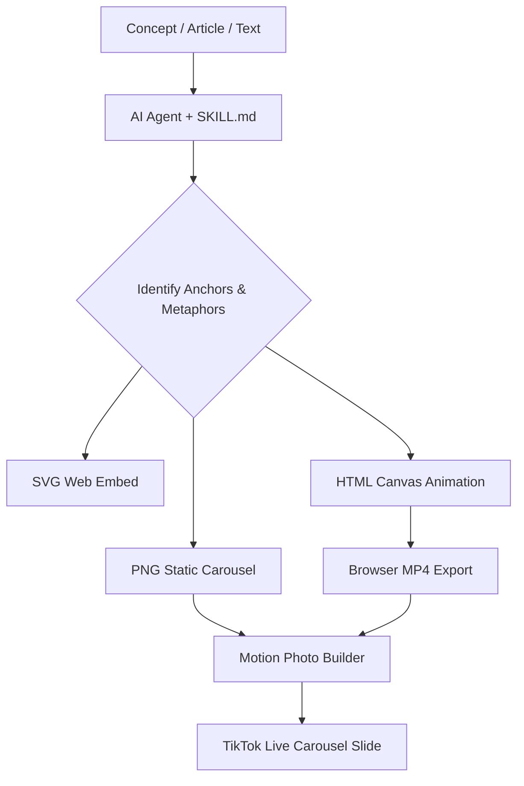

```markdown
# ABIDEMI Illustrations
<p align="center">
  
  
  
</p>
Turn any article, concept, or workflow into a white-background, hand-drawn explanatory illustration.
**Character:** ABIDEMI – a solid black figure with white dot eyes, thin limbs, and a blank expression. Must participate in the core action of every image.
**Format:** 16:9 landscape. Pure white background. Black line art with minimal red/orange/blue accents.
**Outputs:** PNG, SVG, HTML Canvas animation, MP4 video (for TikTok/Instagram Reels slides).
> React component output has been intentionally removed. It has no export path to social media formats.
---
## Workflow Architecture

## Installation
### Package Managers (Any)
```bash
# npm
npm install @bigdrops/abidemi-illustrations
# yarn
yarn add @bigdrops/abidemi-illustrations
# pnpm
pnpm add @bigdrops/abidemi-illustrations
# bun
bun add @bigdrops/abidemi-illustrations
```
The npm package clones the repository to ./skills/abidemi-illustrations/. If the package is not yet published, use the manual method below.
### Manual Installation (Clone)
```bash
git clone [https://github.com/Bigdrops/ABIDEMI-ILLUSTRATIONS.git](https://github.com/Bigdrops/ABIDEMI-ILLUSTRATIONS.git)
cd ABIDEMI-ILLUSTRATIONS
```
Then copy the abidemi-illustrations/ folder to your agent's skills directory.
## Supported Agents, IDEs, and CLIs
This skill works with any tool that reads markdown-based skill definitions. Tested on:

| Category | Tools |
| :--- | :--- |
| **CLI Agents** | Codex, Claude Code, OpenCode, Kiro CLI, Kilo, Gemini CLI |
| **IDEs** | Cursor, Windsurf, VS Code (Copilot Agent), Zed, IntelliJ (with AI plugin) |
| **Package Managers** | npm, yarn, pnpm, bun |
| **Any other** | If your tool reads a SKILL.md file, this works. | <br> ### Agent-Specific Installation Paths
| Agent / IDE | Destination Path |
| :--- | :--- |
| **Codex** | $CODEX_HOME/skills/ or ~/.codex/skills/ |
| **Claude Code** | ~/.claude/skills/ |
| **OpenCode** | ~/.opencode/skills/ |
| **Kiro CLI** | ~/.kiro/skills/ |
| **Kilo** | ~/.kilo/skills/ |
| **Cursor** | .cursor/skills/ (project root) |
| **Windsurf** | .windsurf/skills/ (project root) |
| **VS Code (Copilot Agent)** | .github/skills/ or ~/.vscode/skills/ |
| **Zed** | .zed/skills/ |
| **IntelliJ** | .intellij/skills/ |

### Examples
**Cursor:**
```bash
git clone [https://github.com/Bigdrops/ABIDEMI-ILLUSTRATIONS.git](https://github.com/Bigdrops/ABIDEMI-ILLUSTRATIONS.git)
cp -r ./ABIDEMI-ILLUSTRATIONS/abidemi-illustrations .cursor/skills/
```
**Codex:**
```bash
git clone [https://github.com/Bigdrops/ABIDEMI-ILLUSTRATIONS.git](https://github.com/Bigdrops/ABIDEMI-ILLUSTRATIONS.git)
cp -r ./ABIDEMI-ILLUSTRATIONS/abidemi-illustrations ~/.codex/skills/
```
**VS Code (Copilot Agent):**
```bash
git clone [https://github.com/Bigdrops/ABIDEMI-ILLUSTRATIONS.git](https://github.com/Bigdrops/ABIDEMI-ILLUSTRATIONS.git)
cp -r ./ABIDEMI-ILLUSTRATIONS/abidemi-illustrations .github/skills/
```
### Verify Installation
```bash
# Codex example
codex skills list
# Or check directory exists
ls ~/.codex/skills/abidemi-illustrations/
```
## Usage
```
Use $abidemi-illustrations to illustrate "Bada fixes Quick Share on Chinese phones" as an HTML canvas animation with MP4 export.
```
## Output Formats

| Format | Use Case |
| :--- | :--- |
| **PNG** | Static carousels, blog images, article illustrations |
| **SVG** | Scalable web embeds |
| **HTML Canvas + MP4** | TikTok slides, Instagram Reels, animated social content |

## MP4 Export (TikTok / Instagram)
When the agent generates an HTML Canvas animation, it will also include a self-contained recording script using the browser's MediaRecorder API. Opening the HTML file in Chrome and clicking "Export MP4" will record the animation and download it as an MP4 file ready for upload to TikTok or Instagram Reels.
No external software required. No FFmpeg. No server.
## Motion Photo Export (TikTok Live Slides)
For animated carousel slides on TikTok, combine PNG frames + MP4 into an Android Motion Photo using MotionPhoto Maker app.
TikTok reads Motion Photos natively and plays them as live slides in a carousel post.
Creative formats this enables:
 * **Flipbook:** each slide = one animation frame, viewer swipes fast to see motion
 * **Progressive reveal:** each slide adds one layer until full illustration is complete
## Image Generation Fallback
If your agent environment does not have access to an image generation API (DALL-E, Midjourney, etc.), the skill will output a prompt that you can manually run in Gemini or any image generator. It will also tell you where to save the resulting PNG in your repository.
## Documentation
 * SKILL.md – master skill file
 * references/abidemi-ip.md – character rules
 * references/style-dna.md – visual constraints
 * references/composition-patterns.md – composition types
 * references/qa-checklist.md – quality checks
 * references/prompt-template.md – reusable prompt structure
 * output-formats/ – HTML Canvas, MP4, Motion Photo specifications
## Version
1.0.0
## License
MIT. Original by helloianneo. Extended by Bigdrops.
```
```